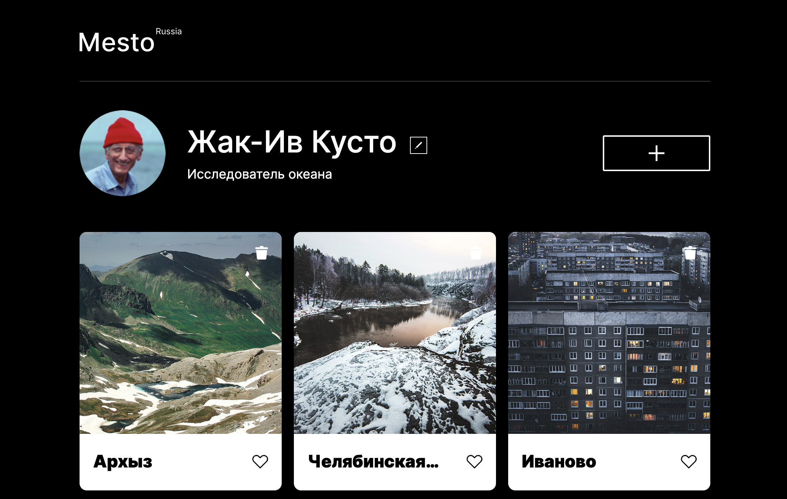

# Проект: Место

Функционал:
* Редактирование профиля
* Добавление, удаление, лайк карточек
* Просмотр карточки в увеличенном размере

Работа выполнена с использованием:
* HTML
* CSS
* БЭМ
* Адаптивная верстка
* JavaScript
* Работа с Figma
* Работа с Perfect Pixel
* Подключение шрифтов
* PopUp
* Валидация форм
* Кнопки

* [Ссылка на макет в Figma](https://www.figma.com/file/2cn9N9jSkmxD84oJik7xL7/JavaScript.-Sprint-4?node-id=0%3A1)

* САЙТ ПРОЕКТА  https://annlevann.github.io/mesto/

